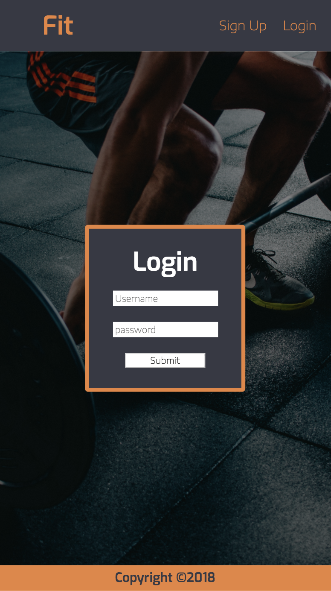

# Fit

Celeste Robinson & Luke Barrett

## Objective

Create a fitness app that allows users to choose exercises from the database, or create their own. They can then add these exercises to a workout, and save the workout. Project should use token authentication to ensure saved workouts only pertain to the signed in user.

### Web Views

##### Login Page Web View

##### Workout Creator Web View

##### Workout List Web View

##### Workout Web View

Login Mobile View | Workout Creator Mobile View | Workout List Mobile View | Workout Mobile View
--- | --- | --- | ---
 |  |  | 
## Links

Github Repository: https://github.com/celesterobinson/fit

## Technologies Used
* HTML, CSS, JavaScript, React/Redux + Thunk, Axios
* Node, Express + Middleware, MongoDB, Mongoose, JWT

## Code Example

## Wireframes

## Future Ideas
* Be able to log a workout while doing it, and save each day's lifts.

* Display a graph of each exercise's weight gain

* Have a personal profile for measurments and weight

* Have a basic food log, or inegrate with MFP

# fit
# fit
